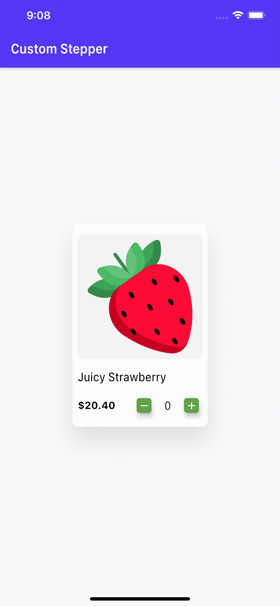
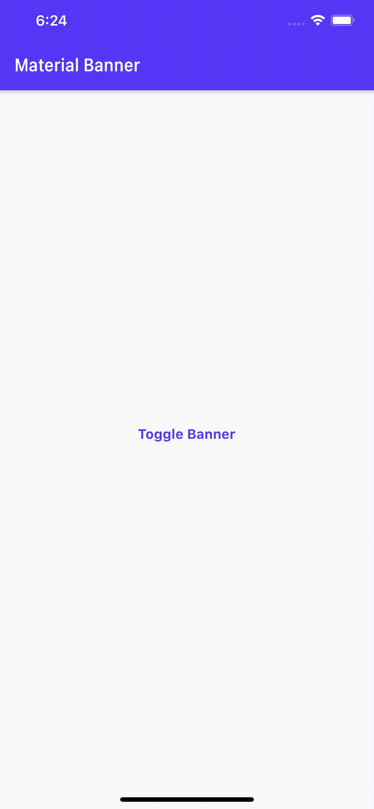

# Flutter UI Components Library

Exclusively For Flutter Developers

## Material

<a href="https://github.com/irangareddy/Flutter-UI-Components-Library/blob/master/lib/material/contextMenu.dart">

<a href="https://github.com/irangareddy/Flutter-UI-Components-Library/blob/master/lib/material/carouselCardList.dart">

<a href="https://github.com/irangareddy/Flutter-UI-Components-Library/blob/master/lib/material/stepper.dart">

